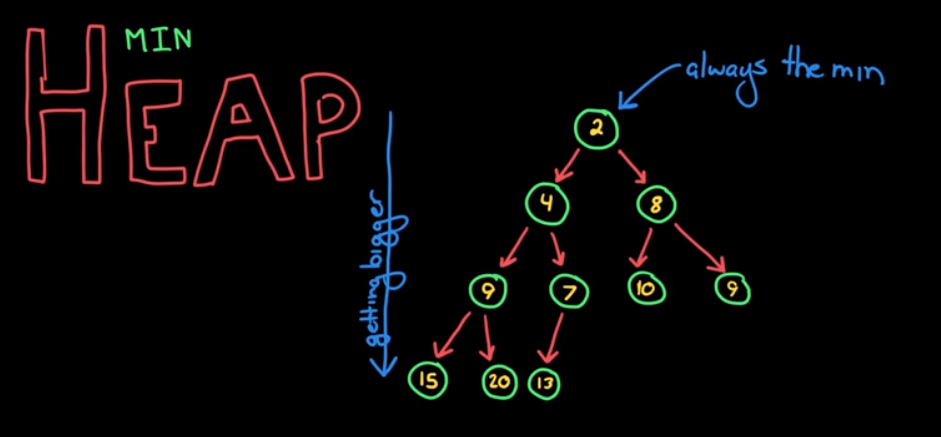

1. min heap or max heap
2. min heap - elements are smaller than children.. so .. root element is smallest.. looking down the tree, elements get bigger and bigger.
3. 
4. how to create and maintain such data structure.
5. insertion - goes to next empty spot. but, for min heap, we need to maintain its structure.. so what we need to do is that, we will first insert the element to the bottom leaf, where there's an empty spot. compare with parent.. suppose it is out of order, then swap the two elements.. keep doing this, until the main structure of min heap is maintained.. that is the parent element should be smaller than the child element.
6. what about removing min element? min element is always the root node. easy to find.. but empty spot.. take it out.. swap the value with last element added.. Now, once we have a new value at the root node. we need to again check with main structure of min heap.. is the value at root node smaller than children or not. if not, then bubble it downwards.. so, keep comparing and then swap the elements. so, do until the heap property is restored.
7.  for impleemntation, should we rely on Node object kind of impleentation? for example:
```
class 
```