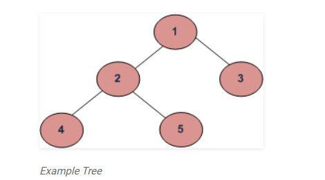

1. [Problem is to find height of binary tree.](https://www.geeksforgeeks.org/write-a-c-program-to-find-the-maximum-depth-or-height-of-a-tree/)

1. code below
2. 

```java

// a node belonging to a binary tree
class Node{

Node left, right;
int data;

public Node(int item){
    data = item;
    left = right = null;
}

}

class BinaryTree{

    Node rootNode;
    
}

```